<!-- HEADER BANNER -->
<p align="center">
  
</p>

<p align="center">
  
  
  
  
  
  
  
</p>  

<p align="center">
  <strong>Explore, analyze, and visualize ocean data using AI-enhanced search, REST APIs, and interactive graphics.</strong><br/>
  Built with <b>FastAPI + RAG backend</b> and a <b>React + Vite</b> frontend.
</p>

<p align="center">
  🔗 <a href="https://aquaverse-demo.com" target="_blank"><strong>Live Demo Coming Soon</strong></a>
</p>

---

## 🌊 UI Previews

| Landing Page | Auth Page |
|--------------|-----------|
|  |  |


---

## 🚀 Key Features

- 🌀 **Automated ARGO Data Pipeline:** Converts NetCDF profiles to Parquet for scalable analytics
- 🤖 **Semantic Ocean Search:** ChromaDB-powered, LLM-augmented contextual queries
- 🗣️ **Natural Language Q&A:** RAG backend translates questions to SQL, summarizes results with LLM
- 🗺️ **Geospatial + Temporal Filtering:** Search by region, depth, time, and marine metrics
- 📊 **Interactive Visualization:** Jupyter/Plotly for maps and time-series graphs
- 🔒 **User Auth & Profiles:** Secure API endpoints for login, profile, and chat-based data exploration

---

## 🛠️ Tech Stack

| Backend                 | Frontend             | Data & Search       |
|:-----------------------:|:-------------------:|:-------------------:|
| 🐍 FastAPI (Python)     | ⚛️ React + Vite     | 🧠 ChromaDB (Vector)|
| 🗃️ PostgreSQL/SQLAlchemy| 🎨 Tailwind CSS     | 🗂️ Parquet + NetCDF |
| 🔥 RAG + LLMs           | 📊 Plotly, Leaflet  | 🌍 Geospatial Query |

---

## 🏗️ Architecture Overview

```mermaid
graph TD
  A[ARGO NetCDF Data] -->|Preprocessing| B[Parquet Files]
  B -->|Load| C[(PostgreSQL DB)]
  B -->|Embedding| D[ChromaDB Vector Store]
  E[FastAPI RAG Backend] -->|REST API| F[React/Vite Frontend]
  C -->|SQL Query| E
  D -->|Semantic Search| E
  E -->|LLM Summarization| F
  F -->|Interactive Visuals| G[Plotly/Leaflet]
  style A fill:#2196f3,stroke:#000,stroke-width:2px
  style B fill:#9dd8fc,stroke:#000,stroke-width:2px
  style C fill:#336791,stroke:#000,stroke-width:2px
  style D fill:#0a192f,stroke:#000,stroke-width:2px
  style E fill:#009688,stroke:#000,stroke-width:2px
  style F fill:#61dafb,stroke:#000,stroke-width:2px
  style G fill:#3f4f75,stroke:#000,stroke-width:2px
```



---

## 📁 Repository Structure

```shell
Aquaverse/
 ├── Data_processing_visuals/   # Jupyter notebooks, e.g., bgc_processing.ipynb
 ├── backend/                   # FastAPI backend, RAG logic, requirements.txt
 │   ├── main.py
 │   ├── rag/
 │   │   └── dataVisualisation.py
 │   └── requirements.txt
 ├── data/                      # ARGO raw (.nc) & processed (.parquet) datasets
 ├── db/chroma_db/              # ChromaDB vector store
 ├── frontend/                  # React + Vite + Tailwind + Plotly client
 │   └── package.json
 └── .gitignore                 # VCS exclusion rules
```

---

## ⚡ Quickstart

```bash
# 1. Clone
git clone https://github.com/<your-username>/Aquaverse.git && cd Aquaverse

# 2. Setup Python backend
cd backend
python -m venv .venv && source .venv/bin/activate
pip install -r requirements.txt

# 3. Setup React frontend
cd ../frontend
npm install

# 4. Download or place ARGO data in /data, ensure .env files are configured

# 5. Run backend
cd ../backend
uvicorn main:app --reload

# 6. Run frontend
cd ../frontend
npm run dev
```

---

## 🔑 API Endpoints

| Endpoint                | Description                           |
|-------------------------|---------------------------------------|
| `/auth/login`           | User authentication                   |
| `/user/profile`         | Get/update user profile               |
| `/data/query`           | Structured/semantic data queries      |
| `/chat/ask`             | Natural language ocean Q&A            |
| `/visuals/profile`      | Visualize temperature/salinity etc.   |

---

## 🗺️ Visualization & Usage

- **Jupyter Notebooks:** Explore data processing in `Data_processing_visuals/`
- **Frontend Dashboards:** View interactive maps & charts (`frontend/`)
- **API Docs:** FastAPI provides auto-generated docs at `/docs`

---


## 💡 Inspired By

- ARGO Ocean Observatories
- OpenAI, HuggingFace, ChromaDB, FastAPI
- Modern Data Visualization & Science Platforms

---
